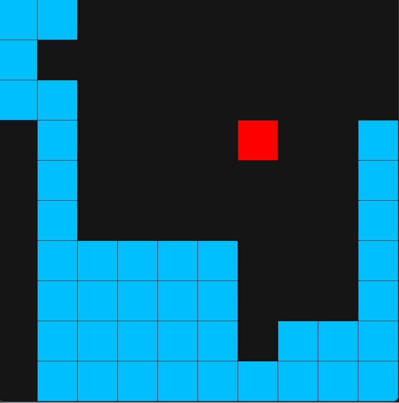
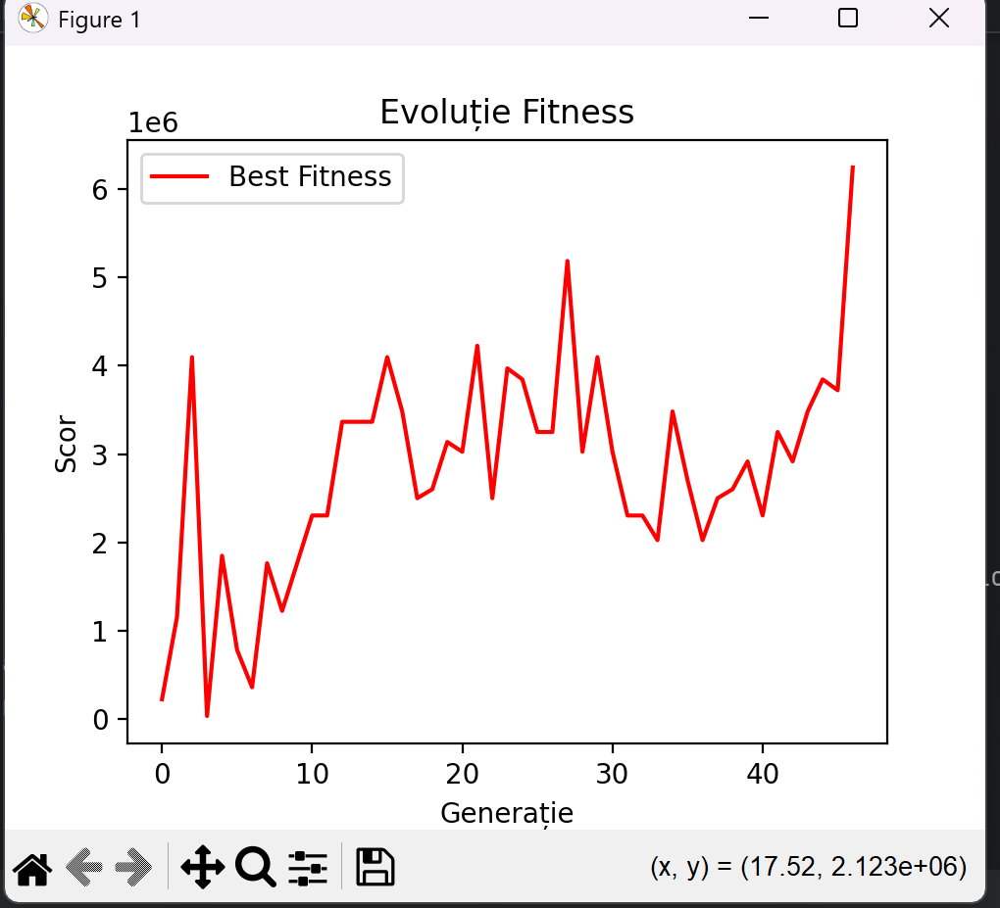

# Snake AI - Neuroevolution & Genetic Algorithm 🐍🧠

An artificial intelligence that learns to play the classic Snake game from scratch using a custom-built Neural Network and Genetic Algorithm. Built entirely in Python without using external machine learning libraries like TensorFlow or PyTorch (only NumPy for matrix operations).

## 🎥 Training Demonstration
Watch the AI learn and navigate the environment:



## 🌟 Features
* **Custom Neural Network:** A Multi-Layer Perceptron (MLP) built from scratch that acts as the "brain" of the snake.
* **Genetic Algorithm:** Implements natural selection, crossover, and mutation to evolve the population over generations.
* **Elitism & Tournament Selection:** Ensures the best traits are passed down to the next generation.
* **Raycasting Vision:** The snake "sees" its environment by casting 8 directional rays to detect distance to food, walls, and its own body.
* **Live Performance Plotting:** Real-time visualization of the AI's fitness progress using Matplotlib.
* **Interactive Controls:** Toggle rendering speeds or isolate the best snake in real-time.

## 📈 Performance Over Time
The fitness progression of the AI over multiple generations:



## 🛠️ Technologies Used
* **Python 3.x**
* **Pygame** (for game rendering and simulation)
* **NumPy** (for optimized Neural Network matrix math)
* **Matplotlib** (for live data visualization)

## 🚀 How to Run

1. **Clone the repository:**
   ```bash
   git clone [https://github.com/RobiDario/Snake-AI-Neuroevolution.git](https://github.com/YourUsername/Snake-AI-Neuroevolution.git)
   cd Snake-AI-Neuroevolution
2. **Install the required dependencies:**

    ```Bash
   pip install pygame numpy matplotlib

3. **Run the simulation:**

    ```Bash
    python game.py
   
## 🎮 Controls (While Running)
You can interact with the simulation in real-time using the following keys:

* **`T` - Test Mode:** Slows down the simulation and isolates the best-performing snake (the Champion) of the current generation so you can watch its decision-making clearly.
* **`F` - Fast Mode:** Disables all Pygame graphics and drawing. This pushes the CPU to focus entirely on math, dramatically speeding up the evolutionary process. Press `F` again to resume rendering.
* **`S` - Save Champion:** Manually forces the simulation to save the current best brain (Neural Network weights and biases) to a `.pkl` file.

## 🧬 How it Works
1. **Population:** A generation starts with 100+ snakes, each with a randomly initialized neural network.
2. **Vision:** The network receives 24 inputs (8 directions × 3 sensors: distance to wall, food, and self).
3. **Action:** The network outputs a decision (Up, Down, Left, Right).
4. **Fitness:** Snakes are rewarded for eating food and surviving, and heavily penalized for starving or hitting walls.
5. **Evolution:** Once all snakes die, the algorithm selects the best performers, mixes their "genes", applies random mutations, and spawns a new generation.